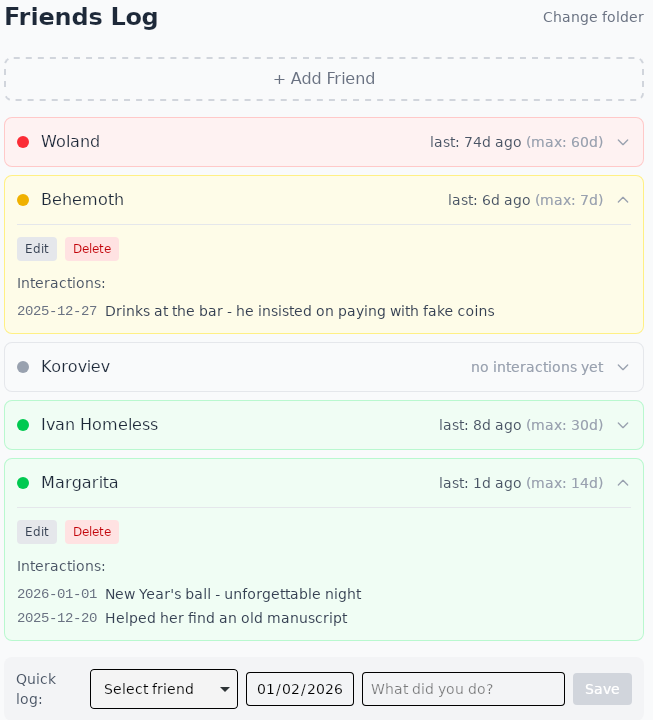

<p align="center">
  
</p>

# Friends Log

A tiny app to track when I last saw my friends so I don't accidentally become a hermit.

## What it does

- Log interactions with friends (date + what you did)
- Set a "max delay" per friend to get visual warnings when you're slacking
- Stores data in a local JSON file you can sync however you want

## Run

```bash
npm install
npm run tauri dev
```

## Tech

Tauri + React + Tailwind. Probably overkill for a JSON file editor but here we are.
